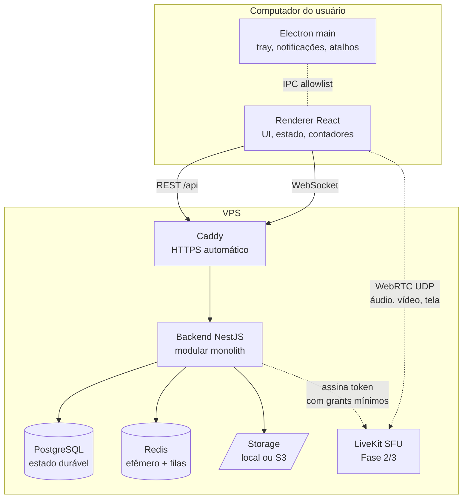
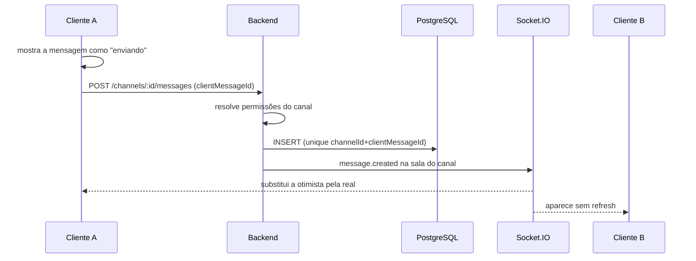
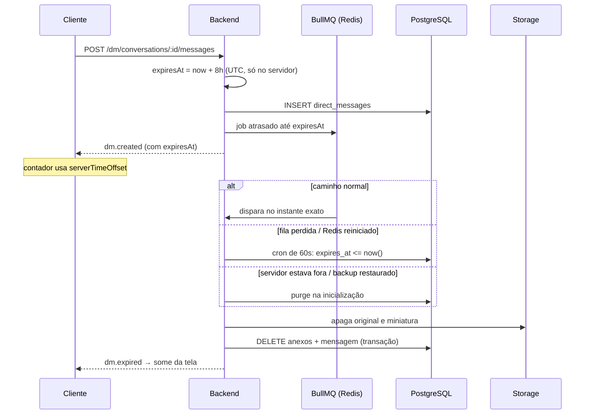
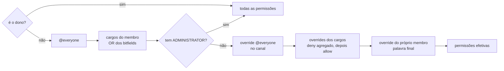

# Arquitetura

## Visão geral



A mídia **não** passa pelo NestJS. O cliente pede um token ao backend, que valida
membership e as permissões `CONNECT` / `SPEAK` / `STREAM`, e então conecta direto ao SFU.
O LiveKit não decide autorização — ele confia no token assinado.

## Envio de uma mensagem



`clientMessageId` torna o envio idempotente: um retry após queda de rede devolve a mensagem
já criada em vez de duplicá-la.

## Ciclo de vida de uma mensagem privada



Em qualquer caminho a leitura já estava protegida: todo `SELECT` de DM filtra
`expiresAt > now()`, então uma mensagem vencida some da API antes mesmo de ser apagada.

## Resolução de permissões

Uma função central (`PermissionsService`), usada por controllers, gateway e downloads.
Nenhuma checagem de permissão é escrita fora dela.



Hierarquia: um membro só age sobre outro (expulsar, banir, mudar cargos) se estiver
estritamente acima. O dono está acima de todos e nunca é alvo. Quem tem `MANAGE_ROLES` não
pode conceder uma permissão que ele mesmo não possui — isso fecha a escalada de privilégio.

## Salas do WebSocket

O cliente **nunca** pede para entrar em uma sala. No handshake o servidor consulta as
associações reais e faz o `join`:

| Sala | Quem entra | Recebe |
|---|---|---|
| `user:{id}` | o próprio usuário (todos os dispositivos) | notificações, amizades, presença própria |
| `server:{id}` | membros do servidor | membros, canais, presença |
| `channel:{id}` | membros do servidor | mensagens, reações, digitação |
| `dm:{id}` | participantes da conversa | DMs, `dm.expired` |

Isso elimina por construção o risco de `socket.join(idArbitrário)`.

## Modelo de dados

Entidades principais e o que as liga:

- **User** ← Session (um por dispositivo), UserSettings, Presence
- **Server** → ServerMember → MemberRole → Role · Category → Channel → ChannelPermission
- **Channel** → Message → MessageAttachment / MessageReaction / PinnedMessage · ChannelRead
- **DirectConversation** → DirectConversationParticipant · DirectMessage → DirectMessageAttachment
- **Auditoria e moderação:** AuditLog, ServerBan, ServerInvite, Notification

Decisões de cascade tomadas conscientemente:

| Relação | Comportamento | Por quê |
|---|---|---|
| `Session → User` | cascade | apagar a conta derruba os dispositivos |
| `Message → Channel` | cascade | apagar o canal apaga o histórico dele |
| `Channel → Category` | `SetNull` | apagar a categoria não deve apagar canais; eles ficam soltos |
| `Message.replyTo` | `SetNull` | apagar a original não apaga as respostas |
| `Server.owner` | sem cascade | o dono não some por acidente; ownership é transferida explicitamente |
| `DirectMessageAttachment → DirectMessage` | cascade **+ remoção do arquivo** | o registro sozinho não basta: o blob também é apagado |

Índices que importam: `Message(channelId, createdAt)`, `DirectMessage(conversationId, createdAt)`,
**`DirectMessage(expiresAt)`** (a reconciliação varre por ele a cada minuto), `Session(expiresAt)`,
`User(username)`, `ServerMember(userId)`, `Notification(userId, createdAt)`.

IDs são CUID2 — não sequenciais, não enumeráveis.

## Contratos de evento

Todo evento sai no mesmo envelope:

```json
{ "event": "message.created", "data": { "...": "..." } }
```

Os nomes e os formatos vivem em `packages/shared/src/events.ts`, com schema Zod por evento.
Backend e cliente importam do mesmo arquivo — um evento não pode divergir entre os dois lados.

## Reconexão

Socket.IO reconecta com backoff exponencial (1 s → 30 s, com jitter). Enquanto isso a UI
mostra "Reconectando…". Eventos perdidos durante a queda não são reenviados: ao voltar, o
cliente recarrega o histórico do canal aberto. Mensagens privadas já expiradas simplesmente
não voltam — o filtro de leitura garante isso.
