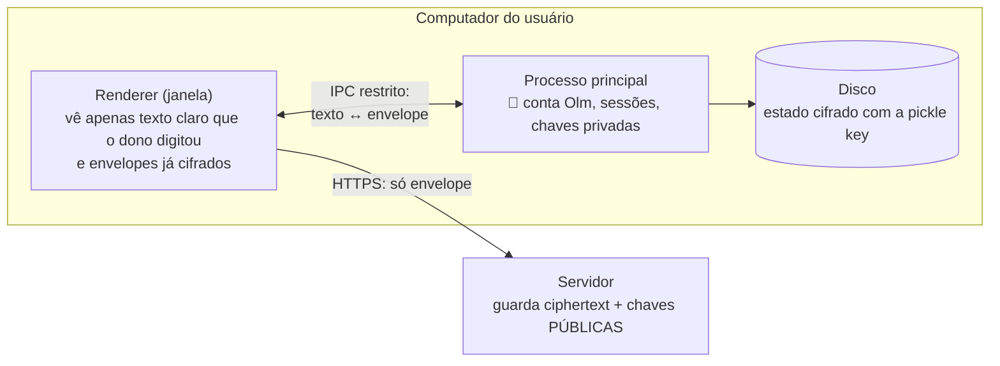
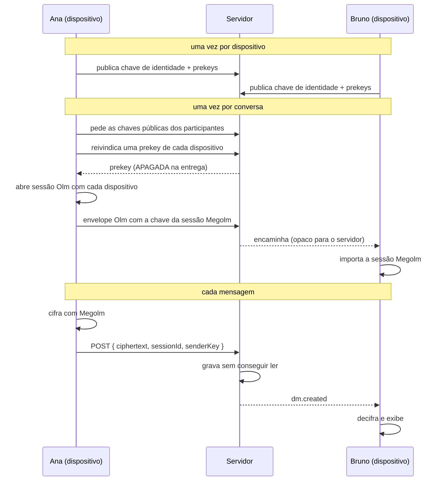

# Criptografia ponta a ponta

As **mensagens privadas** do Nexus — DMs e grupos privados — são cifradas no
dispositivo de quem envia e só podem ser abertas nos dispositivos dos participantes.
O servidor armazena, entrega e apaga bytes que ele não consegue ler.

## Protocolo

**Olm/Megolm** (`@matrix-org/olm`, Apache-2.0), a implementação do Double Ratchet que
o Matrix usou em produção por anos.

> Nenhuma primitiva criptográfica foi escrita neste projeto. O código do Nexus só
> gerencia o ciclo de vida das sessões da biblioteca. Criptografia caseira é a forma
> mais confiável de criar um sistema que *parece* seguro.

Duas camadas, como manda o protocolo:

- **Olm** — Double Ratchet entre dois dispositivos. Usado apenas para entregar a chave
  da sessão de grupo. Tem *forward secrecy*: comprometer a chave de hoje não abre as
  mensagens de ontem.
- **Megolm** — ratchet de grupo. A mensagem é cifrada **uma vez só**, mesmo que a
  conversa tenha 9 pessoas com vários computadores cada.

## Onde as chaves ficam

As chaves privadas vivem **exclusivamente no processo principal do Electron**. A janela
do aplicativo — e qualquer coisa carregada nela — nunca tem acesso a elas.

O estado do Olm é serializado com uma *pickle key* aleatória de 32 bytes, guardada com
o `safeStorage` do Electron — no Windows isso é a **DPAPI**, atrelada à conta de usuário
do sistema. **Copiar a pasta do app para outro computador não dá acesso a nada.**

Se o sistema não oferecer essa proteção (Linux sem keyring), o app avisa na conversa:
*"o sistema não protege as chaves em repouso neste computador"*. Ele não finge que está tudo bem.

## Fluxo de uma mensagem

Cada prekey é entregue **no máximo uma vez** e apagada na entrega, para que duas
sessões nunca partam do mesmo material.

## Anexos

Arquivo enviado em conversa privada é cifrado **no dispositivo**, antes de subir, com
**AES-256-GCM** (WebCrypto do runtime — nenhuma primitiva escrita aqui):

- Chave de 256 bits e IV de 96 bits **novos a cada arquivo**.
- A **miniatura** é gerada antes de cifrar (o servidor não teria como gerá-la depois, já
  que para ele o anexo é ruído) e cifrada com a mesma chave, com IV próprio.
- A chave, o IV, o **nome e o tipo reais** do arquivo viajam **dentro do envelope Megolm**
  da mensagem. No banco, o anexo é `application/octet-stream` com nome `encrypted`.
- GCM é modo autenticado: um blob adulterado no servidor **falha ao decifrar** em vez de
  virar bytes corrompidos na tela.

Como a chave vive dentro da mensagem, o anexo herda todas as garantias dela — inclusive
sumir junto quando as 8 horas acabam.

O upload de anexo cifrado tem endpoint próprio (`POST /files/upload/encrypted`), porque o
servidor não pode inspecionar o conteúdo para descobrir o tipo. Ele continua aplicando o
**limite de tamanho**, que é o que impede abuso. Anexos de canal de servidor seguem pelo
caminho normal, com detecção de tipo por conteúdo e allowlist.

## Rotação de chaves

A sessão Megolm é trocada a cada **8 horas** ou **200 mensagens** — o que vier primeiro —
e também quando alguém entra ou sai da conversa. Isso limita quanto do histórico uma
única chave comprometida conseguiria abrir. Quem sai de um grupo não lê o que vier depois.

## O que o servidor **não** consegue ver

- O conteúdo das mensagens privadas.
- Os anexos das conversas privadas.
- Qualquer chave privada.

## O que o servidor **ainda** vê (metadados)

Isto precisa ser dito, não presumido:

- **Quem conversa com quem**, e quando.
- **O tamanho** das mensagens e dos anexos.
- Quantos dispositivos cada pessoa tem, e as chaves públicas deles.
- Tudo dos **canais de servidor**, que não são E2EE por decisão de projeto.

Proteger metadados exige coisas como *sealed sender* e mixing — outra ordem de
complexidade, e fora de escopo para 9 amigos com uma VPS própria.

## Consequências que você vai notar no uso

Não são bugs; são o preço do E2EE, e o app é honesto sobre eles:

| Situação | O que acontece |
|---|---|
| Instalou num PC novo | Ele **não lê** as mensagens privadas anteriores. A UI diz: *"enviada antes deste computador entrar na conversa"*. Como as DMs somem em 8h de qualquer jeito, na prática isso quase não incomoda. |
| Reinstalou o app | Vira um dispositivo novo, com chaves novas. Os contatos são avisados. |
| Perdeu o computador | Remova o dispositivo em Configurações → Sessões. Ele deixa de receber chaves novas. |
| Fez logout | Todo o material criptográfico local é apagado. |
| Backup do servidor | Restaura ciphertext. Continua ilegível — e, se já venceu, é apagado no boot. |

## Verificando um contato (número de segurança)

Cada dispositivo tem um *fingerprint* derivado da sua chave Ed25519, exibido em grupos
de 5 caracteres. Dois amigos comparam o número por um canal que já confiam (pessoalmente,
por telefone) e confirmam que estão falando com quem pensam.

**Sem essa verificação**, um servidor malicioso poderia anunciar uma chave falsa e se
colocar no meio. É por isso que o app avisa quando um dispositivo novo aparece na conversa.

## Sem downgrade silencioso

Esta é a regra mais importante da implementação: **se a criptografia não estiver pronta,
o envio é bloqueado.** Não existe caminho no código em que uma mensagem privada saia em
texto puro. Rodando fora do aplicativo instalado (onde não há como guardar chave privada
com segurança), o campo de mensagem fica desabilitado com o motivo explícito.

## Testes

`apps/desktop/test/crypto.spec.ts` roda o **Olm de verdade**, com duas instâncias
independentes simulando dois computadores. Entre outras coisas, verifica que:

- Bruno decifra o que Ana enviou;
- o que trafega até o servidor **não contém** o texto original;
- quem não tem a chave da sessão recebe `NO_SESSION`, não o conteúdo;
- mensagem adulterada em trânsito é **rejeitada**, não aceita em silêncio;
- uma prekey já consumida não estabelece uma segunda sessão;
- o estado sobrevive a fechar e reabrir o aplicativo;
- num grupo, um único envelope é lido por todos os participantes.

`apps/server/test/integration/e2ee.spec.ts` verifica o lado do servidor: que ele grava
apenas ciphertext, recusa envelope forjado com o dispositivo de outra pessoa, entrega
cada prekey uma única vez e encaminha envelopes sem conseguir abri-los.
